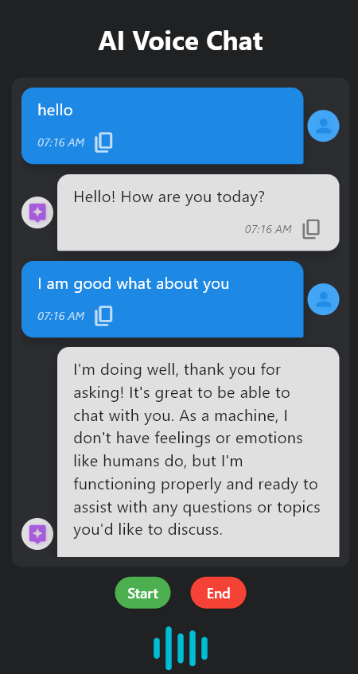

# 🎙️ AI Voice Chat
Welcome to **AI Voice Chat** — a smart, responsive voice chatbot for **Android and Desktop**, built using **Python**, **Flet**, **LangChain**, and **Ollama** with **LLaMA 3** integration.

🗣️ **Speak naturally** — just like you're talking to a human.  
🧠 **Get real-time intelligent responses** powered by LLaMA 3.  
🔊 **Listen to lifelike voice replies** generated through advanced TTS.  
💬 **Experience seamless conversations** in a sleek, modern chat interface.  
📱 **Works on both desktop and Android** (via Flet mobile support).


---

---

## ✨ Features

- 🎤 Real-time voice recognition using `speech_recognition`
- 🧠 Smart AI responses with `LangChain`, `Ollama`, and `LLaMA 3`
- 🔊 Spoken replies using `edge-tts` and `pygame`
- 📱 Responsive Flet-based UI
- 🕒 Messages include timestamps, avatars, and a copy button
- 🌊 Dynamic waveform animation while listening

---

## 🧰 Tech Stack

| Technology         | Purpose                            |
|--------------------|-------------------------------------|
| Python             | Core programming language           |
| Flet               | UI framework (similar to Flutter)   |
| LangChain + Ollama | Interface to LLaMA 3 model          |
| edge-tts           | Text-to-speech voice generation     |
| pygame             | Plays audio responses               |
| SpeechRecognition  | Captures and transcribes mic input  |

---


## 📦 Installation

### 🔧 Prerequisites

- Python 3.9 or higher
- [Ollama](https://ollama.com) installed and running
- Internet access (needed for `edge-tts`)

---

### 🛠️ Setup

Clone the repository and navigate into it:

```bash
git clone https://github.com/IUA03/AI-Voice-Chat.git
cd AI-Voice-Chat
```

Install the dependencies:

```bash
pip install -r requirements.txt
```

Start the LLaMA 3 model (Ollama must be installed):

```bash
ollama run llama3
```

---

## ▶️ Run the App

### On Desktop:

```bash
flet run main.py
```

### On Android (via Flet):

```bash
flet run main.py --android
```
